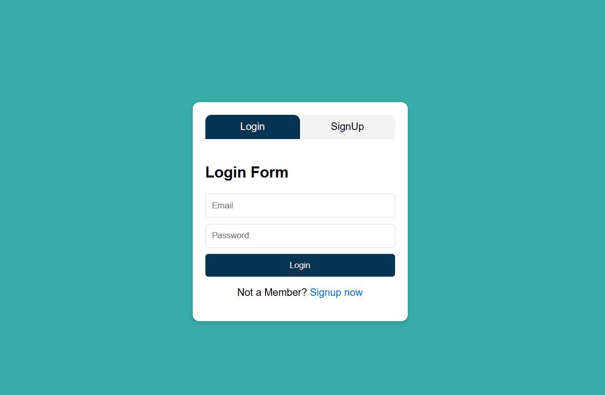
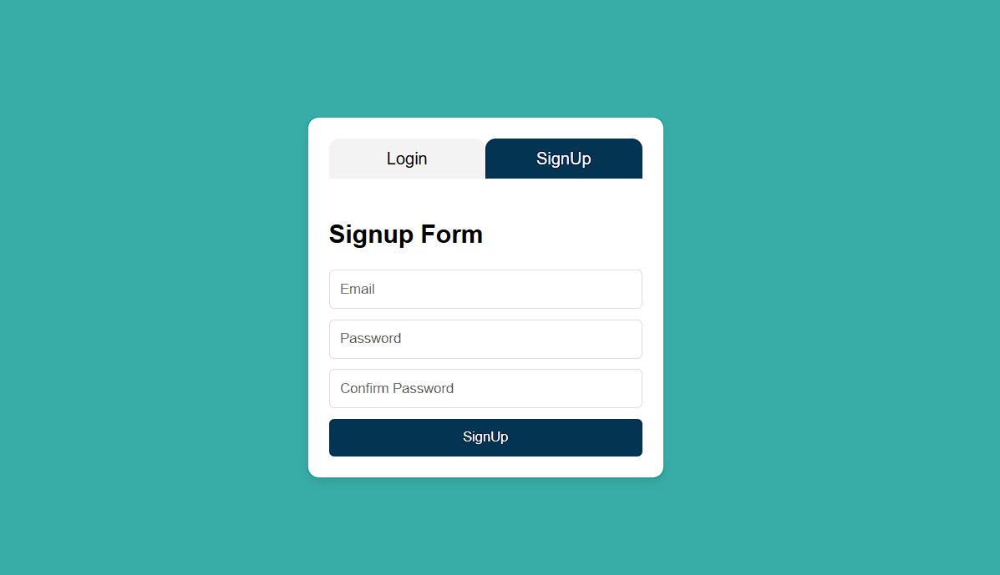

# MyApp: Authentication System with React and Node.js

 

## Description

MyApp is a web-based authentication system integrating **React**, **Node.js**, and **PostgreSQL** to provide seamless user login and signup functionality. The project utilizes `bcrypt` for secure password hashing and `passport.js` for session-based authentication. It also supports seamless redirection between EJS and React-based components for a flexible front-end experience.

---

## Features

- **User Authentication:**
  - Login with session management.
  - Sign up with password hashing (via `bcrypt`).

- **Secure Secrets Page:**
  - Access restricted content for authenticated users.
  - Redirection to React login/signup page when unauthorized.

- **Logout Functionality:**
  - Session termination with redirect to the login page.

- **Dynamic Front-end:**
  - Login and Sign-up forms in React with easy toggling.
  - Styled with **Bootstrap** and **FontAwesome**.

---

## Tech Stack

- **Frontend:**
  - React.js (Dynamic forms and toggling)
  - EJS (Secrets page)
  - Bootstrap (Styling)

- **Backend:**
  - Node.js & Express.js
  - PostgreSQL (User data storage)
  - **Passport.js** (Authentication middleware)

- **Others:**
  - Bcrypt.js (Password hashing)
  - Dotenv (Environment configuration)
  - CORS and Express-session (Middleware)

---

## Installation

### Prerequisites

- Node.js (v14+)
- PostgreSQL (Database setup)
- `.env` file with the following configuration:

  ```env
  PG_USER=your_database_user
  PG_PASSWORD=your_database_password
  PG_HOST=localhost
  PG_DATABASE=your_database_name
  PG_PORT=5432
  SESSION_SECRET=your_secret_key


### Steps

Here is the rewritten **Installation** section for your `README.md` file:

```markdown
## Installation

### 1. Clone the Repository:
Clone the repository to your local machine and navigate into the project directory:
```bash
git clone https://github.com/your-repo/myapp.git
cd myapp
```

### 2. Install Dependencies:
Run the following command in the project root to install all required Node.js dependencies:
```bash
npm install
```

### 3. Set Up the Database:
Log in to your PostgreSQL instance and execute the following SQL command to create the `users` table:
```sql
CREATE TABLE users (
    id SERIAL PRIMARY KEY,
    email VARCHAR(255) UNIQUE NOT NULL,
    password VARCHAR(255) NOT NULL
);
```

### 4. Configure Environment Variables:
Create a `.env` file in the root directory and add the following configurations:
```env
PG_USER=your_database_user
PG_PASSWORD=your_database_password
PG_HOST=localhost
PG_DATABASE=your_database_name
PG_PORT=5432
SESSION_SECRET=your_secret_key
```

### 5. Run the Backend Server:
Start the Node.js backend server by running the following command:
```bash
npm start
```
The backend server will run at [http://localhost:3000](http://localhost:3000).

### 6. Start the React Client:
Navigate to the `client` directory and install its dependencies:
```bash
cd client
npm install
```

Start the React development server by running the following command:
```bash
npm start
```
The React client will run at [http://localhost:5173](http://localhost:5173).
```

This provides a clear, step-by-step guide for setting up and running your project, from cloning the repository to running both the backend and frontend servers.

## Usage

Once the backend and frontend are up and running, you can access the application via your browser:

- **Home Page:** Displays a welcoming message for authenticated users who are logged in.
- **Secrets Page:** Provides access to restricted content that is only available to logged-in users.
- **Login and Sign-up:** Use the React interface to log in with your credentials or create a new account.
- **Logout:** Log out of the application securely. After logging out, you will be redirected to the login page.


Your updated `README.md` is already detailed and user-friendly. However, I'll refine the structure slightly for better readability and consistency while maintaining all essential information. Here's the improved version:

---

# MyApp: Authentication System with React and Node.js  

   

## Description  

MyApp is a secure, web-based authentication system integrating **React**, **Node.js**, and **PostgreSQL**. It enables user login and signup functionality with password hashing using `bcrypt` and session-based authentication via `passport.js`. The system seamlessly supports a dynamic front-end experience using React and EJS for restricted content pages.  

---  

## Features  

- **User Authentication:**  
  - Login with session management.  
  - Sign up with password hashing using `bcrypt`.  

- **Secure Secrets Page:**  
  - Access restricted content for authenticated users.  
  - Unauthorized users are redirected to the React login/signup page.  

- **Logout Functionality:**  
  - Secure session termination with redirection to the login page.  

- **Dynamic Front-End:**  
  - Toggleable login and signup forms built with React.  
  - Styled using **Bootstrap** and **FontAwesome**.  

---  

## Tech Stack  

### Frontend  
- **React.js:** Interactive forms and dynamic UI.  
- **EJS:** Templates for the secrets page.  
- **Bootstrap & FontAwesome:** Modern and responsive styling.  

### Backend  
- **Node.js & Express.js:** RESTful APIs for user management.  
- **PostgreSQL:** Database for secure user data storage.  

### Others  
- **Bcrypt.js:** Password hashing for secure storage.  
- **Dotenv:** Environment variable management.  
- **CORS & Express-session:** Middleware for secure communication.  

---  

## Installation  

### Prerequisites  

Ensure the following are installed on your system:  

- **Node.js** (v14 or later)  
- **PostgreSQL**  
- **Git**  

### Environment Variables  

Create a `.env` file in the project root with the following configuration:  
```env  
PG_USER=your_database_user  
PG_PASSWORD=your_database_password  
PG_HOST=localhost  
PG_DATABASE=your_database_name  
PG_PORT=5432  
SESSION_SECRET=your_secret_key  
```  

### Steps  

#### 1. Clone the Repository  

Clone the repository to your local machine and navigate into the project directory:  
```bash  
git clone https://github.com/your-repo/myapp.git  
cd myapp  
```  

#### 2. Install Dependencies  

Run the following command in the project root to install all required Node.js dependencies:  
```bash  
npm install  
```  

#### 3. Set Up the Database  

Log in to your PostgreSQL instance and execute the following SQL command to create the `users` table:  
```sql  
CREATE TABLE users (  
    id SERIAL PRIMARY KEY,  
    email VARCHAR(255) UNIQUE NOT NULL,  
    password VARCHAR(255) NOT NULL  
);  
```  

#### 4. Run the Backend Server  

Start the Node.js backend server:  
```bash  
npm start  
```  
The backend server will be available at [http://localhost:3000](http://localhost:3000).  

#### 5. Start the React Client  

Navigate to the `client` directory and install its dependencies:  
```bash  
cd client  
npm install  
```  

Start the React development server:  
```bash  
npm start  
```  
The React client will be available at [http://localhost:5173](http://localhost:5173).  

---  

## Usage  

Once the backend and frontend servers are running, access the application via your browser:  

- **Home Page:** Welcomes authenticated users upon login.  
- **Secrets Page:** Displays restricted content for logged-in users.  
- **Login and Sign-up:** Use React forms to log in or create a new account.  
- **Logout:** Log out securely; users will be redirected to the login page.  

---  


